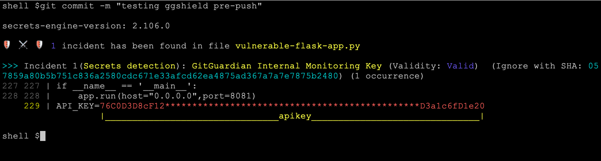

A pre-commit hook is a client-side git hook that runs right before a reference is pushed to a remote (git push)

GitGuardian pre-commit hook is performed through  CLI utility: ggshield. ggshield is a wrapper around the GitGuardian API for secrets detection that requires an API key to work.

# The pre-commit framework
In order to use GitGuardian shield with the pre-commit framework, you need to perform the following steps.

Make sure you have the pre-commit framework installed

Create a .pre-commit-config.yaml file in your repository's root path

Steps to use:

1. Sign in to your GitGuardian workspace and create a Personal Access Token from your personal settings.

2. Add this Personal Access Token (API key) to the GITGUARDIAN_API_KEY environment variable in your repository

3. stage your changes

4. commit your changes

output will look like this if detect any secrets:

-----
